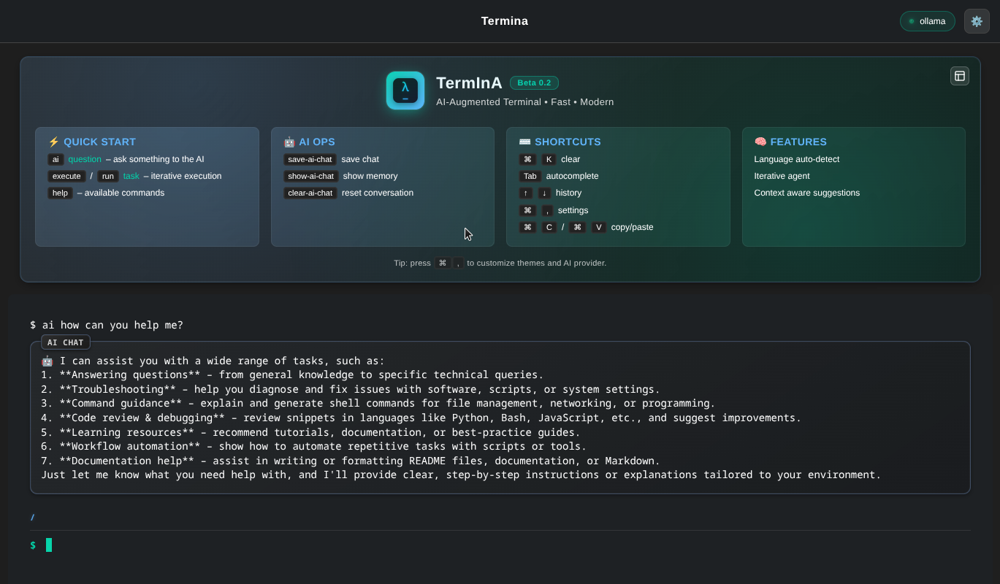

# Electron Terminal Emulator

<p align="center">
  
  <h2>Termina — Modern terminal emulator with AI integration</h2>
  
  

  <details>
    <summary><strong>Version</strong></summary>
    <p>v0.2 Beta</p>
  </details>
</p>

⚠️ Warning: This software is still in Beta version 0.2. Some features may be unstable.

## 📥 Download

<table>
<tr>
<td align="center">

### 🪟 Windows
**ARM64** | **x64**
:---:|:---:
[](https://secure.ue.internxt.com/sh/file/m_m9-XaqQ7a4KYQZA_KuZA/VMCxxoNI) | [](https://share.eu.internxt.com/sh/file/J0G83C-hRCKXdnUOpsfoRg/kGa4WdG1)

</td>
<td align="center">

### 🍎 macOS
[](https://share.eu.internxt.com/sh/file/u2AZJKf_RVOxP7Bih1cwHw/s1MweZpd)

</td>
<td align="center">

### 🐧 Linux
**ARM64** | **x64**
:---:|:---:
[](https://secure.eu.internxt.com/sh/file/uhMTvpgYTuysThON9l616w/i95sx11a) | [](https://secure.ue.internxt.com/sh/file/UKSnsnDqQVqwXpDjWKxUPA/ZRWBfv_s)

</td>
</tr>
</table>

## 🌟 Features

### ✨ Modern Design
- **Warp-inspired interface** - Sleek, modern UI with smooth animations
- **Custom themes** - Multiple built-in themes (Warp Dark, Warp Light, Cyberpunk, Classic)
- **Transparency & blur effects** - Beautiful glass-like appearance
- **Responsive design** - Adapts to different screen sizes

### 🤖 AI Integration
- **Multiple AI providers** - Support for Gemini, OpenAI, and local models
- **LM Studio integration** - Connect to local AI models running on LM Studio
- **Smart command suggestions** - AI analyzes context and suggests relevant commands
- **Iterative AI Agent** - 🆕 AI that executes commands and iterates until success
- **Auto-execution with verification** - 🆕 Automatic command execution with result verification
- **Error recovery** - 🆕 AI learns from failures and tries alternative approaches
- **Automatic language detection** - 🆕 AI responds in the same language as your question
- **Multi-language support** - 🆕 Italian, English, Spanish, French, German support
- **Context awareness** - AI remembers recent commands and outputs
- **Execution history** - 🆕 Complete log of AI actions and reasoning
- **Web Integration** - 🌐 **NEW** AI can search the internet for up-to-date information when needed

### 🔧 Advanced Terminal Features
- **Modern xterm.js** - Full-featured terminal emulation
- **Custom prompts** - Beautiful, informative command prompts
- **Copy & Paste** - 🆕 Full clipboard integration with keyboard shortcuts
- **Command autocomplete** - 🆕 Intelligent Tab completion for commands
- **History navigation** - 🆕 Arrow keys to navigate command history
- **AI conversation management** - 🆕 Save, view, and clear AI chat history
- **Smart keyboard shortcuts** - 🆕 Cmd/Ctrl combinations for productivity
- **Smart text wrapping** - Intelligent text formatting
- **Syntax highlighting** - Color-coded output

### ⚙️ Extensive Customization
- **Settings interface** - Easy-to-use settings panel
- **Font customization** - Choose from popular monospace fonts
- **Color themes** - Fully customizable color schemes
- **Keyboard shortcuts** - Configurable key bindings
- **Window appearance** - Customize transparency, vibrancy, and more

### 🌐 Web Integration Features
- **Intelligent web searching** - AI automatically determines when to search online
- **Multiple search engines** - Support for Google, Bing, and DuckDuckGo
- **Content extraction** - Automatically extracts and summarizes web content
- **Response enhancement** - Integrates web information with AI responses
- **Search history** - Tracks and manages web search activities
- **Configurable thresholds** - Adjust when AI should search online
- **Fallback handling** - Graceful degradation when web search fails

## 🚀 Quick Start

### Prerequisites
- Node.js 16+ 
- npm or yarn
- macOS 10.15+ or Linux

### Web Integration Configuration

The web integration is enabled by default. You can configure it in `~/.termina/config.json`:

```json
{
  "webscraper": {
    "enabled": true,
    "defaultSearchEngine": "google",
    "confidenceThreshold": 0.7,
    "maxResults": 5,
    "timeout": 10000
  }
}
```

**Key settings:**
- `enabled`: Enable/disable web integration
- `confidenceThreshold`: When AI should search online (0.0-1.0)
- `maxResults`: Maximum search results to process
- `timeout`: HTTP request timeout in milliseconds

### Installation

```bash
# Clone the repository
git clone https://github.com/yourusername/termina.git
cd termina

# Install dependencies
npm install

# Start the application
npm start
```

### Development

```bash
# Start in development mode
npm run dev

# Build for production
npm run build

# Create distributable
npm run dist

# Test web integration
node test-webscraper.js
```

## 🎯 Usage

### AI Commands with Web Integration

The AI can now automatically search the internet when it needs up-to-date information:

```bash
# Ask AI with automatic web search when needed
ai: What's the current Bitcoin price?

# Force web-enhanced AI response
ai-web: What are the latest Node.js features?

# Regular AI command (no web search)
ai: How do I create a directory?
```

**Examples of when AI automatically searches online:**
- Current prices and market data
- Latest software versions
- Recent news and events
- Time-sensitive information
- Product specifications
- Local business information

### Basic Commands

| Command | Description |
|---------|-------------|
| `ai: <question>` | Ask the AI assistant |
| `ai-web: <question>` | Ask AI with web search integration |
| `run: <command>` | Execute command with confirmation |
| `settings` | Open settings panel |
| `clear` | Clear terminal |
| `help` | Show help information |

### Multi-language AI Commands

The AI automatically detects your language and responds accordingly:

```bash
# Italian
ai Come installo Node.js?

# English  
ai How do I install Node.js?

# Spanish
ai ¿Cómo instalo Node.js?

# French
ai Comment installer Node.js?

# German
ai Wie installiere ich Node.js?
```

Supported languages: **Italian**, **English**, **Spanish**, **French**, **German**

### Keyboard Shortcuts

| Shortcut | Action |
|----------|--------|
| `⌘K` | Clear terminal |
| `⌘,` | Open settings |
| `⌘⇧A` | Toggle AI assistant |
| `⌘T` | New tab (planned) |
| `⌘W` | Close tab (planned) |

### AI Providers

#### Gemini (Google)
1. Get your API key from [Google AI Studio](https://makersuite.google.com/)
2. Open Settings → AI → Gemini Configuration
3. Enter your API key

#### LM Studio (Local)
1. Install and run [LM Studio](https://lmstudio.ai/)
2. Start the local server (usually http://localhost:1234)
3. Open Settings → AI → LM Studio Configuration
4. Configure endpoint and model name

#### OpenAI
1. Get your API key from [OpenAI](https://platform.openai.com/)
2. Open Settings → AI → OpenAI Configuration
3. Enter your API key

## 🧠 AI Agent - Advanced Features

### Command Modes

Termina now features an **Iterative AI Agent** that can execute commands automatically and learn from results:

#### Suggestion Mode (Classic)
```bash
ai "create a backup of my documents folder"
ask "show disk usage"
```
*AI suggests commands but doesn't execute them*

#### Execution Mode (New!) 🆕
```bash
execute "create a backup of my documents folder"
run "find and clean temporary files"
```
*AI executes commands automatically and iterates until success*

### How Iterative Execution Works

1. **Analysis** - AI analyzes your request and determines the best approach
2. **Execution** - Automatically runs the suggested command
3. **Verification** - Checks if the result meets your original request
4. **Iteration** - If unsuccessful, tries alternative approaches (max 5 attempts)
5. **Learning** - Each iteration considers previous failures to improve

### Example: Smart Problem Solving

```bash
execute "free up 2GB of disk space"
```

The AI Agent will:
- Check current disk usage: `df -h`
- Identify large files: `du -sh ~/Downloads/* | sort -rh`
- Clean cache: `rm -rf ~/.cache/*`
- Empty trash if needed
- Verify 2GB was actually freed
- Report success or try alternative methods

### Advanced Use Cases

```bash
# System maintenance
execute "optimize my Mac's performance"

# Development setup
run "setup a Python environment for data science"

# File management
execute "organize my Downloads folder by file type"

# Security check
run "scan for suspicious processes using too much CPU"
```

### Execution History & Transparency

Every AI action is logged with:
- ✅ Commands executed
- 💭 AI reasoning
- 📊 Results obtained
- 🔄 Number of iterations
- ❌ Errors and recovery attempts

See [AI Agent Guide](docs/AI_AGENT_GUIDE.md) for detailed examples and best practices.

## 🔧 AI Provider Configuration

TermInA supports multiple AI providers with easy switching:

### Quick Setup
1. **Gemini** (Free): Get API key from [Google AI Studio](https://makersuite.google.com/)
2. **OpenAI** (Paid): Get API key from [OpenAI Platform](https://platform.openai.com/)
3. **LM Studio** (Local): Download from [lmstudio.ai](https://lmstudio.ai/)

### Provider Features
| Provider | Cost | Privacy | Quality | Speed |
|----------|------|---------|---------|-------|
| Gemini | Free/Paid | Cloud | High | Very Fast |
| OpenAI | Paid | Cloud | Excellent | Fast |
| LM Studio | Free* | Local | Good | Variable** |

*After initial hardware investment  
**Depends on hardware and model

See [Multi-AI Setup Guide](docs/MULTI_AI_SETUP.md) for complete configuration instructions.

## � New Terminal Features 2.0 🆕

Termina 2.0 introduces powerful terminal enhancements for a better user experience:

### 📋 Copy & Paste
- **Smart copy**: `Cmd+C` copies selected text or current line if nothing selected
- **Quick paste**: `Cmd+V` pastes from clipboard with automatic cleanup
- **Select all**: `Cmd+A` selects all terminal content
- **Clean input**: Pasted text is automatically cleaned of control characters

### ⚡ Command Autocomplete
- **Tab completion**: Press `Tab` for intelligent command suggestions
- **System commands**: `ls`, `cd`, `git`, `npm`, `python`, etc.
- **TermInA commands**: `ai`, `execute`, `help`, `clear`, etc.
- **Smart filtering**: Shows only relevant completions based on your input

### 🔄 History Navigation
- **Arrow keys**: Use ↑/↓ to navigate command history
- **Session memory**: Remembers all commands from current session
- **Fast access**: Quickly rerun or modify previous commands

### 💬 AI Conversation Management
- **Save chats**: `save-ai-chat` exports conversations to Downloads folder
- **View history**: `show-ai-chat` displays current session conversations
- **Clear memory**: `clear-ai-chat` resets conversation history
- **Auto-formatting**: Saved files include timestamps and command results

### ⌨️ Keyboard Shortcuts
| Shortcut | Action |
|----------|--------|
| `Cmd/Ctrl + C` | Copy selected text or current line |
| `Cmd/Ctrl + V` | Paste from clipboard |
| `Cmd/Ctrl + A` | Select all content |
| `Cmd/Ctrl + K/L` | Clear terminal |
| `↑/↓` | Navigate command history |
| `Tab` | Autocomplete commands |

**📚 See [Terminal Features Guide](docs/TERMINAL_FEATURES.md) for detailed examples and usage tips.**

## �🎨 Themes

Termina comes with several built-in themes:

- **Warp Dark** - The default dark theme inspired by Warp
- **Warp Light** - Clean light theme for day use
- **Terminal Classic** - Traditional green-on-black terminal
- **Cyberpunk** - Neon colors for a futuristic look

You can also create custom themes by modifying colors in the settings panel.

## 🛠️ Configuration

The configuration file is stored at `~/.termina/config.json`. You can edit it directly or use the settings interface.

### Example Configuration

```json
{
  "theme": {
    "name": "warp-dark",
    "background": "#1e2124",
    "foreground": "#ffffff", 
    "cursor": "#00d4aa"
  },
  "ai": {
    "provider": "gemini",
    "autoExecute": false,
    "contextLines": 10
  },
  "terminal": {
    "fontSize": 14,
    "fontFamily": "JetBrains Mono",
    "cursorBlink": true
  }
}
```

## 📚 Documentation

For detailed information about features and configuration, see the [docs/](docs/) folder.

### Web Integration Documentation

- **[WebScraper Integration Guide](docs/WEBSCRAPER_INTEGRATION.md)** - Complete guide to web integration features
- **[AI Agent Guide](docs/AI_AGENT_GUIDE.md)** - How to use the AI agent with web capabilities
- **[API Reference](docs/API.md)** - Technical API documentation

## 🏗️ Architecture

```
termina/
├── main.js              # Main Electron process
├── preload.js           # Preload script for security
├── src/
│   ├── config.js        # Configuration management
│   ├── ai-manager.js    # AI provider abstraction
│   ├── ai-agent.js      # AI agent with web integration
│   ├── webscraper.js    # Web scraping capabilities
│   ├── web-ai-integration.js # Web-AI integration layer
│   ├── language-detector.js  # Multi-language support
│   ├── system-info.js        # System information
│   └── path-alias.js         # Path alias management
├── renderer/
│   ├── index.html       # Main window
│   ├── renderer.js      # Terminal logic
│   ├── style.css        # Main styles
│   ├── settings.html    # Settings window
│   ├── settings.js      # Settings logic
│   └── settings-style.css
├── docs/                # Documentation
│   └── WEBSCRAPER_INTEGRATION.md
├── test-webscraper.js   # Web integration tests
└── assets/              # Icons and images
```

## 🤝 Contributing

We welcome contributions! Please see our [Contributing Guide](CONTRIBUTING.md) for details.

### Development Setup

1. Fork the repository
2. Create a feature branch
3. Make your changes
4. Test thoroughly
5. Submit a pull request

### Code Style
- Use ESLint for JavaScript
- Follow the existing code style
- Add comments for complex logic
- Update documentation as needed

## 📝 License

This project is licensed under the MIT License - see the [LICENSE](LICENSE) file for details.

## 🙏 Acknowledgments

- [Warp](https://warp.dev/) - For design inspiration
- [xterm.js](https://xtermjs.org/) - For the excellent terminal emulator
- [Electron](https://electronjs.org/) - For the application framework
- [LM Studio](https://lmstudio.ai/) - For local AI model support

## 🐛 Known Issues

- Tab functionality is planned for v2.1
- Windows support is experimental
- Some AI providers may have rate limits
- Web scraping may be limited by search engine rate limits
- Some websites may block automated requests

## 🗺️ Roadmap

### v2.1 (Next Release)
- [x] Web integration with AI agent
- [x] Automatic web searching when needed
- [ ] Multiple tabs support
- [ ] Split panes
- [ ] Theme marketplace
- [ ] Plugin system

### v2.2 (Future)
- [ ] Integrated file explorer
- [ ] Git integration
- [ ] SSH session management
- [ ] Custom AI prompts

## 📞 Support

-  Issues: [GitHub Issues](https://github.com/yourusername/termina/issues)

---

**Made with ❤️ by Simone Pappalardo Caltabiano**

## Quick Start

1. Install dependencies:
   ```bash
   npm install
   ```
2. Start the application:
   ```bash
   npm start
   ```

## Project Structure
- `main.js`: Main Electron process
- `renderer/`: User interface and terminal (xterm.js)
- `src/`: AI integration modules

## Notes
- For local AI integration, consult LM Studio documentation or other compatible APIs.
- The app is designed to be extensible and customizable.
