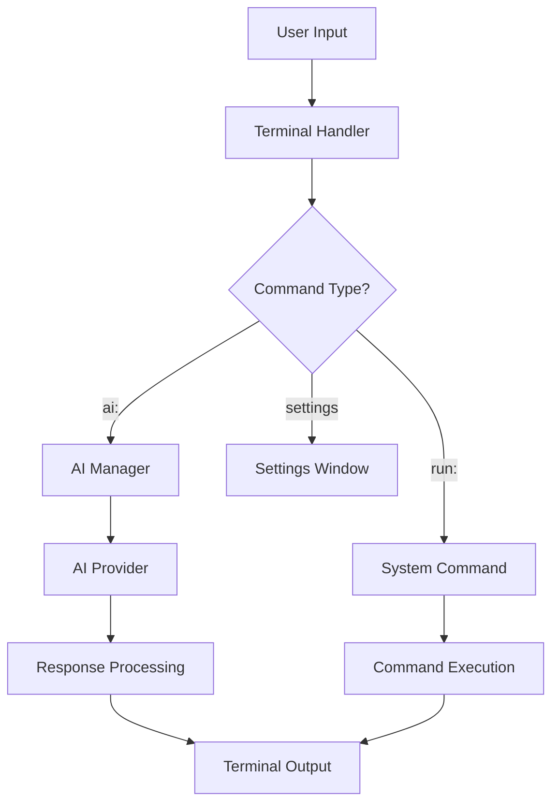

# Termina API and Plugin Development

This documentation describes Termina's internal architecture and how to develop extensions.

## 🏗️ Architecture

### Electron Processes

```
Main Process (main.js)
├── Config Manager (src/config.js)
├── AI Manager (src/ai-manager.js)
└── IPC Handlers

Renderer Process (renderer/renderer.js)
├── Terminal Class
├── AI Integration
└── UI Management

Preload (preload.js)
└── Security Bridge
```

### Data Flow



## 🔌 Plugin System (Planned)

### Plugin Structure

```javascript
// plugin-example.js
class TerminaPlugin {
  constructor(api) {
    this.api = api;
    this.name = 'ExamplePlugin';
    this.version = '1.0.0';
  }

  // Called when the plugin is loaded
  onLoad() {
    this.api.addCommand('example', this.handleExample.bind(this));
    this.api.addTheme('example-theme', {
      background: '#000000',
      foreground: '#ffffff'
    });
  }

  // Handles the custom command
  async handleExample(args) {
    return `Hello from ${this.name}! Args: ${args.join(' ')}`;
  }

  // Called when the plugin is unloaded
  onUnload() {
    this.api.removeCommand('example');
    this.api.removeTheme('example-theme');
  }
}

module.exports = TerminaPlugin;
```

### Plugin API

```javascript
// API available to plugins
class PluginAPI {
  // Commands
  addCommand(name, handler) { }
  removeCommand(name) { }
  
  // Themes
  addTheme(name, theme) { }
  removeTheme(name) { }
  
  // Events
  on(event, callback) { }
  off(event, callback) { }
  emit(event, data) { }
  
  // Terminal
  write(text) { }
  writeln(text) { }
  clear() { }
  
  // AI
  requestAI(prompt) { }
  
  // Storage
  getPluginData(key) { }
  setPluginData(key, value) { }
  
  // UI
  showNotification(message) { }
  showDialog(options) { }
}
```

## 🛠️ Current Internal API

### Config Manager

```javascript
const config = require('./src/config');

// Read configuration
const theme = config.get('theme');
const aiProvider = config.get('ai.provider');

// Write configuration
config.set('theme.background', '#000000');
config.set('ai.provider', 'openai');

// Reset configuration
config.resetToDefaults();
```

### AI Manager

```javascript
const aiManager = require('./src/ai-manager');

// AI request
const response = await aiManager.request(prompt, context);

// Check provider
const isConfigured = aiManager.isProviderConfigured('gemini');

// List providers
const providers = aiManager.getAvailableProviders();
```

### Terminal Class

```javascript
// Public methods of ModernTerminal class
class ModernTerminal {
  // Setup
  async init()
  async loadConfig()
  setupTerminal()
  
  // I/O
  async handleInput(data)
  async executeCommand()
  
  // AI
  async handleAICommand(prompt)
  writeAIResponse(response)
  
  // UI
  writeWelcome()
  prompt()
  clearTerminal()
  
  // Utility
  wrapText(text, maxWidth)
  extractCommand(response)
  isValidCommand(command)
}
```

## 📡 IPC Events

### Main → Renderer

```javascript
// Events that the main process sends to the renderer
mainWindow.webContents.send('toggle-ai');
mainWindow.webContents.send('clear-terminal');
mainWindow.webContents.send('new-tab');
mainWindow.webContents.send('close-tab');
```

### Renderer → Main

```javascript
// Events that the renderer sends to the main process
ipcRenderer.invoke('get-config', key);
ipcRenderer.invoke('set-config', key, value);
ipcRenderer.invoke('ai-request', prompt, context);
ipcRenderer.invoke('run-command', command);
ipcRenderer.invoke('open-settings');
```

## 🎨 UI Extensions

### Custom CSS

I plugin potranno iniettare CSS personalizzato:

```css
/* plugin-styles.css */
.plugin-example {
  background: linear-gradient(45deg, #ff0000, #00ff00);
  border-radius: 8px;
  padding: 10px;
}

.terminal-custom-prompt {
  color: #ff69b4;
  font-weight: bold;
}
```

### Custom Components

```javascript
// Custom UI components
class CustomComponent {
  constructor(container) {
    this.container = container;
    this.element = null;
  }

  render() {
    this.element = document.createElement('div');
    this.element.className = 'plugin-component';
    this.element.innerHTML = `
      <h3>Plugin Component</h3>
      <button onclick="this.handleClick()">Click me</button>
    `;
    this.container.appendChild(this.element);
  }

  handleClick() {
    // Click logic
  }

  destroy() {
    if (this.element) {
      this.element.remove();
    }
  }
}
```

## 🔐 Plugin Security

### Sandboxing

I plugin saranno eseguiti in un ambiente sandboxed:

```javascript
// Plugin sandbox
class PluginSandbox {
  constructor(pluginCode) {
    this.vm = new VM({
      timeout: 5000,
      sandbox: {
        console: { log: this.safeLog.bind(this) },
        require: this.safeRequire.bind(this),
        api: this.createPluginAPI()
      }
    });
  }

  safeRequire(module) {
    const allowedModules = ['path', 'util'];
    if (allowedModules.includes(module)) {
      return require(module);
    }
    throw new Error(`Module ${module} not allowed`);
  }
}
```

### Permissions

```json
{
  "pluginManifest": {
    "name": "example-plugin",
    "version": "1.0.0",
    "permissions": [
      "terminal.write",
      "ai.request", 
      "storage.read",
      "storage.write"
    ],
    "trustedDomains": [
      "api.example.com"
    ]
  }
}
```

## 📊 Events and Hooks

### Terminal Events

```javascript
// Events available for plugins
api.on('terminal.ready', () => {
  console.log('Terminal is ready');
});

api.on('command.executed', (command, output) => {
  console.log(`Command: ${command}, Output: ${output}`);
});

api.on('ai.response', (prompt, response) => {
  console.log(`AI responded to: ${prompt}`);
});

api.on('theme.changed', (newTheme) => {
  console.log(`Theme changed to: ${newTheme.name}`);
});
```

### Modification Hooks

```javascript
// Hook to modify behaviors
api.addHook('command.before', (command) => {
  // Modify the command before execution
  if (command.startsWith('sudo')) {
    return `echo "Sudo not allowed in plugins" && ${command}`;
  }
  return command;
});

api.addHook('ai.prompt', (prompt) => {
  // Modify the prompt before sending it to the AI
  return `[Plugin Context] ${prompt}`;
});
```

## 🧪 Testing API

### Unit Tests

```javascript
// test/plugin-api.test.js
const { PluginAPI } = require('../src/plugin-api');

describe('Plugin API', () => {
  let api;

  beforeEach(() => {
    api = new PluginAPI();
  });

  test('should register command', () => {
    const handler = jest.fn();
    api.addCommand('test', handler);
    
    expect(api.commands['test']).toBe(handler);
  });

  test('should execute command', async () => {
    const handler = jest.fn().mockResolvedValue('test output');
    api.addCommand('test', handler);
    
    const result = await api.executeCommand('test', ['arg1']);
    expect(result).toBe('test output');
    expect(handler).toHaveBeenCalledWith(['arg1']);
  });
});
```

### Integration Tests

```javascript
// test/integration.test.js
const { app } = require('electron');
const { ModernTerminal } = require('../renderer/renderer');

describe('Terminal Integration', () => {
  let terminal;

  beforeEach(async () => {
    terminal = new ModernTerminal();
    await terminal.init();
  });

  test('should handle AI command', async () => {
    const result = await terminal.executeCommand('ai: test question');
    expect(result).toContain('AI Response');
  });
});
```

## 📦 Packaging and Distribution

### Plugin Package Structure

```
my-plugin/
├── package.json
├── index.js          # Entry point
├── manifest.json     # Plugin manifest
├── styles/
│   └── plugin.css
├── assets/
│   └── icon.png
└── test/
    └── plugin.test.js
```

### Plugin Manifest

```json
{
  "name": "my-awesome-plugin",
  "version": "1.0.0", 
  "description": "An awesome plugin for Termina",
  "author": "Your Name",
  "license": "MIT",
  "termina": {
  "minVersion": "0.2.0-beta",
  "maxVersion": "1.x"
  },
  "main": "index.js",
  "permissions": [
    "terminal.write",
    "ai.request"
  ],
  "dependencies": {
    "lodash": "^4.17.21"
  }
}
```

---

Note: The plugin system is in the design phase and will be introduced starting with Termina 0.3.
